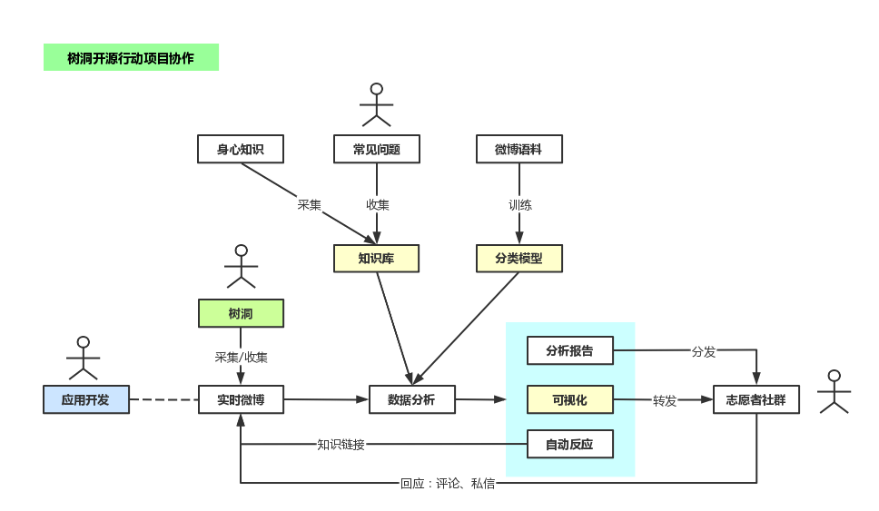

## 树洞开源行动
<!-- ALL-CONTRIBUTORS-BADGE:START - Do not remove or modify this section -->

<!-- ALL-CONTRIBUTORS-BADGE:END -->
### 一、项目简介
|          |                                 |
| -------- | ------------------------------- |
| 社区名称 | OY                              |
| 项目名称 | 树洞开源行动                    |
| 服务对象 | 14~25岁的青少年人群             |
| 服务场域 | 网络社交媒体平台为主，如微博、贴吧等     |
| 项目地址 | https://github.com/oyouth       |

#### 项目主题
通过信息技术，发现处于心理困境中的青少年网友，引导他们自助、互助，以及向外界寻求帮助。

#### 微博树洞
“树洞”，源自童话故事《长着驴耳朵的国王》，它被人们赋予了隐藏秘密、袒露心声的内涵。

>“我有抑郁症，所以就去死一死，没什么重要的原因，大家不必在意我的离开。拜拜啦。”——走饭树洞

微博“树洞”，一般是指已故之人所发的微博（遗言）。网友们前来倾诉心事，抱团取暖，也有宣泄负面情绪，甚至有自伤、自杀和约死的行为发生。

**——他们不知道该如何求助，该向谁求助。**

广义的微博“树洞”，包括微博话题、超话等场域。其共同的特点是大量人群聚集，倾诉、求助的帖子很快就被海量信息淹没。

**——他们声音微弱，转瞬即逝，被人遗忘。**

####  我们可以做些什么？
• 主动发现

我们可以通过采集树洞里的实时信息，运用人工智能技术进行分析、识别和解读，主动去发现求助者，聆听他们的声音。

他们会诉说什么？

    ◦ 正在经受着的痛苦
    ◦ 学业上的压力
    ◦ 失眠
    ◦ 家庭矛盾
    ◦ 遭遇到了霸凌
    ◦ 严重的自伤倾向

还要留意：

    ◦ 网络诈骗（骗钱、骗色）
    ◦ 网络暴力

• 知识链接

我们注意到树洞中的朋友们，有对身心症状的恐惧，有讨论治疗方案、药物作用，也有询问心理咨询、热线和医院的信息……我们可以收集常见的问题，建立一个知识数据库，当帖子触及相关的问题，我们可以主动推送相关的知识，帮助他们解除困惑。

知识库的构成：

    ◦ 常见心理知识
    ◦ 身心症状、药物反应说明
    ◦ 心理热线、医院等机构的联络方式
    ◦ 紧急情况联系电话

• 社会支持

当我们看到处于困境中人们，不免为之所触动。此时，或许一声问候，就可以让对方感到温暖，重拾希望。我们可以建立一个分发机制，将匿名的求助信息、分析报告，发送给志愿者群组，让更多的人看见，及时地伸出援手。

社会支持的来源：

    ◦ 专业的社会服务机构
    ◦ 志愿者个人或群组
    ◦ 可信赖的朋友和家人

### 二、项目示意图

    
### 三、主要项目清单
| 名目 | 仓库 |
| ---- | ---- |
|   数据集   |    https://github.com/oyouth/dataset  |
|   采集脚本   |   https://github.com/oyouth/collect  |
### 四、贡献者（Contributors）
<!-- ALL-CONTRIBUTORS-LIST:START - Do not remove or modify this section -->
<!-- prettier-ignore-start -->
<!-- markdownlint-disable -->
<table>
  <tbody>
    <tr>
      <td align="center" valign="top" width="14.28%"><a href="https://github.com/rendao"> <b>metric</b></a> <a href="#infra-rendao" title="Infrastructure (Hosting, Build-Tools, etc)">🚇</a> <a href="https://github.com/oyouth/shudong/commits?author=rendao" title="Tests">⚠️</a> <a href="https://github.com/oyouth/shudong/commits?author=rendao" title="Code">💻</a></td>
      <td align="center" valign="top" width="14.28%"><a href="https://github.com/csliubo"> <b>csliubo</b></a> <a href="#infra-csliubo" title="Infrastructure (Hosting, Build-Tools, etc)">🚇</a> <a href="https://github.com/oyouth/shudong/commits?author=csliubo" title="Tests">⚠️</a> <a href="https://github.com/oyouth/shudong/commits?author=csliubo" title="Code">💻</a></td>
    </tr>
  </tbody>
</table>

<!-- markdownlint-restore -->
<!-- prettier-ignore-end -->

<!-- ALL-CONTRIBUTORS-LIST:END -->

### 五、交流群组
| 群组      | 入口                                                                                                             |
| --------- | ---------------------------------------------------------------------------------------------------------------- |
| Slack群组 | [我要加入群组](https://join.slack.com/t/w1657004756-7mb553859/shared_invite/zt-1brvjku4n-mPhGMcBd8~_NUXAjhjfiKA) |

## Contributors ✨

Thanks goes to these wonderful people ([emoji key](https://allcontributors.org/docs/en/emoji-key)):

<!-- ALL-CONTRIBUTORS-LIST:START - Do not remove or modify this section -->
<!-- prettier-ignore-start -->
<!-- markdownlint-disable -->
<!-- markdownlint-restore -->
<!-- prettier-ignore-end -->
<!-- ALL-CONTRIBUTORS-LIST:END -->

This project follows the [all-contributors](https://github.com/all-contributors/all-contributors) specification. Contributions of any kind welcome!